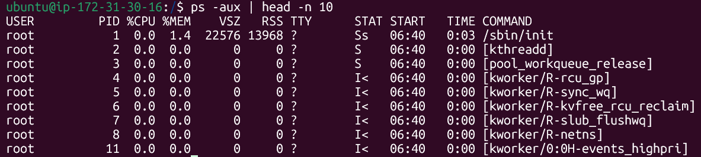
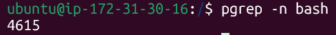
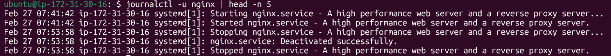

# Commands I practiced and their real-time outputs

## Process Commands
* `ps a` - Displays a snapshot of all current running processes on the system

---
* `ps -aux | head -n 10` - It lists all the running processes on the system with the top 10 lines

---

* `pgrep -n bash` - It selects only the newest (most recently started) of the matching processes

---

## Service Commands

* `systemctl status nginx` - Shows the status of the service (Active or Inactive) 

---
* `systemctl list-units --type=service --state=inactive` - Lists all the inactive service units that uses systemd 

---

## Log Commands
* `journalctl -u docker | head -n 10` - Shows the logs of the docker service and only displays the first 10 lines

---
* `tail -n 20 /var/log/syslog` - Displays the last 20 lines of the log file `/var/log/syslog`

---
## Inspection of *Nginx* service 
* `systemctl status nginx` - Shows the current status of the *Nginx* service - whether it is running, stopped or failed - along with recent logs and process details

---
* `journalctl -u nginx | head -n 5` - Displays the first 5 log entries of the nginx service from the system journal, helping you quickly check its initial log messages

---
* `sudo systemctl start nginx` - Starts the nginx service with administrative privileges
  * Since the service was stopped, this command restarts it and brings it back to a running state

---

* `systemctl status nginx` - Shows the status of *Nginx* service. It is successfully up and running

