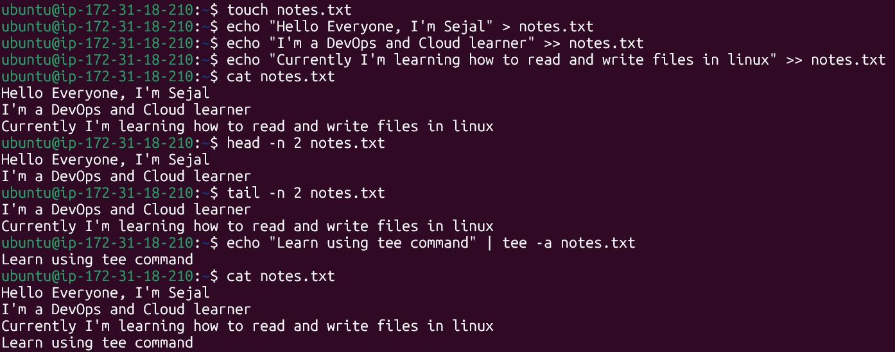

# Read and Write text files in Linux

* `touch notes.txt` - Create a file named notes.txt
---
* `echo "Hello Everyone, I'm Sejal" > notes.txt` - Redirects the output "Hello Everyone, I'm Sejal" inside notes.txt. Writes inside of notes.txt
---
* `echo "I'm a DevOps and Cloud learner" >> notes.txt`
* `echo "Currently I'm learning how to read and write text files in linux" >> notes.txt` - Append to notes.txt
---
* `cat notes.txt` - Read notes.txt
---
* `head -n 2 notes.txt` - Read first two lines of notes.txt
---
* `tail -n 2 notes.txt` - Read last two lines of notes.txt
---
* `echo "Learn using tee command" | tee -a notes.txt` - Write using tee command that also prints the output to terminal -a appends
---
## Performed hands-on execution of the above commands

