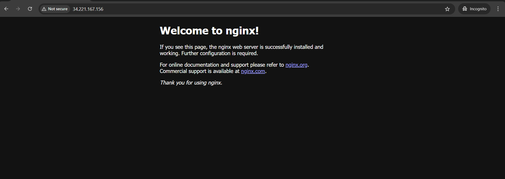

# Set up and deploy a Real Web Server on a Cloud
## Part 1: Launch a Cloud Instance & SSH Access (15 minutes)
Step 1: Create and launch an instance using the AWS management console

Step 2: Connect to instance using `ssh`
* Command: `sudo ssh -i "josh-batch10-devops-superkey.pem" ubuntu@ec2-34-221-167-156.us-west-2.compute.amazonaws.com`
---
## Part 2: Install Docker & Nginx (20 minutes)
Step 1: Update system 
* Command: `sudo apt update`

Step 2: Install the service 
* Command: `sudo apt install <service-name>` (for e.g., `sudo apt install docker.io`)

Step 3: Check if the service is installed and running
* Command: `<service-name> --version && systemctl status <service-name>` (for e.g., `docker --version && systemctl status docker`)
---
## Part 3: Security group configuration (10 minutes)
Step 1: Configure security groups for web access. From the AWS console, go to the security group and add an inbound rule for port 80 (default for Nginx)

Step 2: Test web access: Open browser and visit: `http://<your-instance-ip>`

---
## Part 4: Extract Nginx Logs (15 minutes)
Step 1: View nginx logs
* Command: `journalctl -u nginx -20`

Step 2: Save log to file and download it to your local machine
* Command: `scp -i "josh-batch10-devops-superkey.pem" ubuntu@ec2-34-221-167-156.us-west-2.compute.amazonaws.com:/var/log/nginx/access.log .`
---
# Challenges Faced
1. Unable to access Nginx using the public IP

* Solution: The issue occurred because port 80 was not allowed in the security group inbound rules. After adding port 80, the Nginx server became accessible through the public IP

2. Unable to copy logs to the local machine

* Solution: I had forgotten to add the `. (dot)` at the end of the `scp` command, which specifies downloading the file to the current directory. After adding it, the logs were successfully copied
---
# What I learned 
1. Learned how to connect to an AWS cloud instance using SSH
2. Gained hands-on experience installing Nginx and hosting a webpage
3. Practiced securely transferring files from the cloud instance to the local machine using `scp`
4. Resolved confusion between `journalctl` logs and Nginx access logs. Understood that `journalctl -u nginx` displays service-related logs, while HTTP request logs are stored in `/var/log/nginx/access.log`
