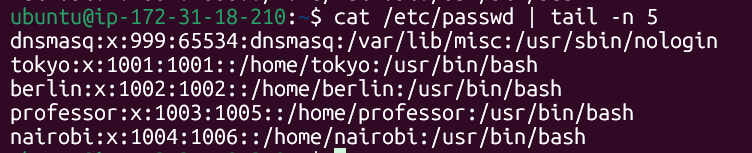
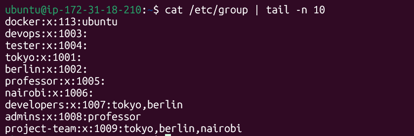
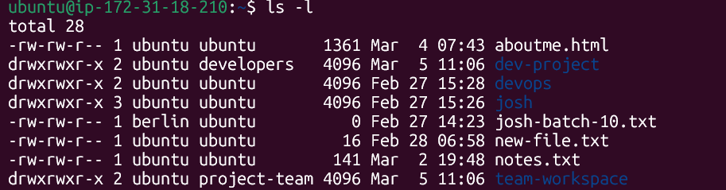
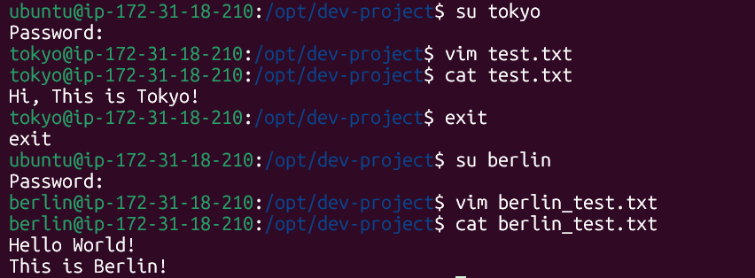
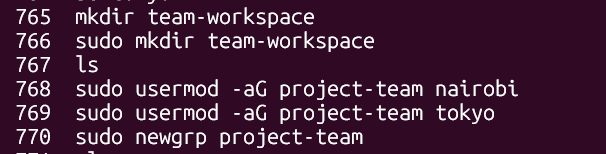

# Linux User & Group Management

## Users & Groups created
* User add command: `useradd -m username`
  * Users: tokyo, berlin, professor, nairobi

* Group add command: `groupadd groupname`
  * Groups: developers, admins, project-team

## Group assignment
* Added users to different groups: `sudo usermod -aG groupname username`

## Directories created
* Modified the permisson for the group of the directories: `sudo chgrp groupname directory_name`

## Home Directories of Users
* Created all the users under the `/home` directory

## Shared Directory
1. Create directory: `/opt/dev-project`
2. Set group owner to developers
3. Set permissions to 775 (rwxrwxr-x)
4. Test by creating files as tokyo and berlin

## Team Workspace 
1. Create a user `nairobi` with home directory
2. Create group `project-team`
3. Add `nairobi` and `tokyo` to `project-team`
4. Create `/opt/team-workspace` directory
5. Set group to `project-team` permissions to `775`
6. Test by creating file `nairobi`

# Commands Used
* `useradd -m uname` - Add user with default directory
* `sudo passwd uname` - Set password for user
* `groupadd groupname` - Add group
* `sudo usermod -s /bin/bash username` - Change shell
* `sudo usermod -aG group user` - Assign user to group
* `sudo chgrp new_group directory/file`  - Change group ownership of a directory or file
* `sudo chmod 775 file/directory` - Change permissions of a file or directory

# What I Learned
* Gained a clear understanding of how user and group management works in Linux. Practiced configuring file permissions and observed how they affect collaboration in shared environments.
* Learned that even if two users belong to the same group and have access to a shared directory, they cannot automatically modify each other’s files. By default, when a user creates a file inside a directory:
  * The file is owned by the user and their primary group, which may not necessarily be the directory’s group.
  * Default file permissions typically allow write access only to the owner, while the group has read-only access.
  * As a result, other group members can view the file but cannot edit or delete it.
* Explored this behavior through a shared directory scenario and understood how permissions influence collaborative workflows.
