# File Permissions & File Operation Challenge
## Files Created 
1. Create empty file `devops.txt` using `touch`
2. Create `notes.txt` with some content using `cat` or `echo`
3. Create `script.sh` using `vim` with content: `echo "Hello DevOps"`
  * Verify: `ls -l` to see permissions

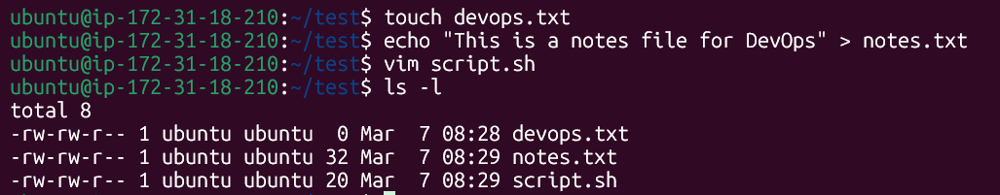
---
## Read Files
1. Read `notes.txt` using `cat`
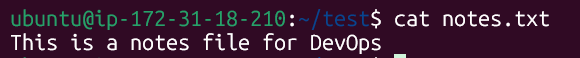

2. View `script.sh` in vim read-only mode
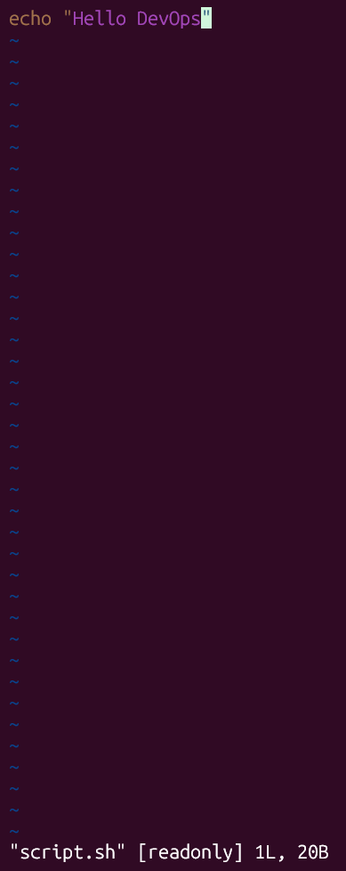

3. Display first 5 lines of `/etc/passwd` using `head`
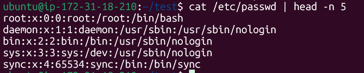

4. Display last 5 lines of `/etc/passwd` using `tail`
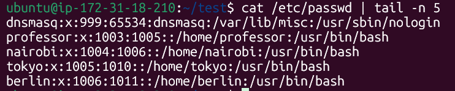
---
## Understand Permissions
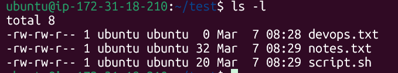

* Current permissions
devops.txt: -rw-rw-r--
  * `-` -> At the start `-` indicates it's a regular file (not a directory of a special file)
  * `rw-` -> First `rw-` is for (user/owner) which means read + write, can't execute
  * `rw-` -> Second `rw-` is for (group) which means read + write, can't execute
  * `r--` -> Third `r--` is for (others) whcih means read only, can't write or execute
* Same permissions are applied to notes.txt and script.sh
---
## Modify Permissions
* Make `script.sh` executable -> run it with `./script.sh`
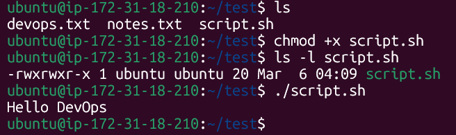
* Set `devops.txt` to read-only (remove write for all)
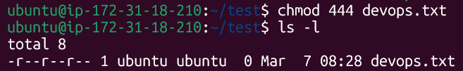
* Set `notes.txt` to `640` (owner:rw, group:r, others:none)
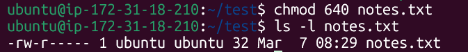
* Create directory `project/` with permissions `755`
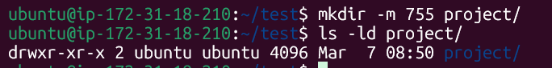
---
## Test Permissions
* Try writing to read-only file - what happens?
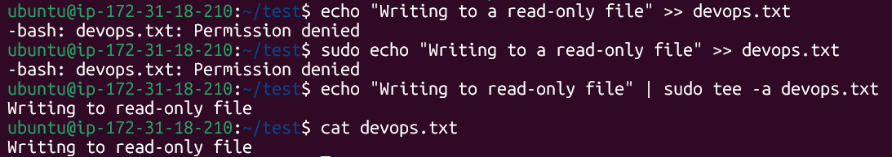 
  * Trying to write to a read-only file usually results in a “Permission denied” error. Using `sudo` can allow you to write to the file, but only if the redirection is performed with root privileges (for example, using tee or sudo bash -c). However, even sudo cannot modify the file if it has the immutable attribute set with `chattr +i` or if the filesystem itself is mounted as read-only.
* Try executing a file without execute permission
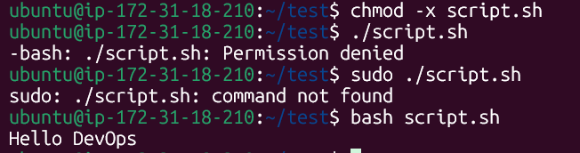 
  * If a file does not have execute permission, trying to run it results in a “Permission denied” error. Even sudo cannot bypass this restriction because the shell requires the execute bit to run the file directly. However, the file can still be executed by calling the interpreter explicitly, such as `bash script.sh` or `python3 script.py`
---
# Comands Used
* `touch filename` - Create an empty file
* `echo "Hello World"` > filename - Creates a file with content
* `vim filename` - Creates and opens a text editor named Vim
* `cat filename` - Prints content of file
* `vim -R filename` - Opens the file in read-only mode
* `cat /etc/passwd | head -n 5` - Prints first 5 lines of /etc/passwd file
* `cat /etc/passwd | tail -n 5` - Prints last 5 lines of /etc/passwd file
* `chmod +x filename` - Adds executable permission for all (owner, group, others)
* `chmod -w filename` - Removes write permissions for all (owner, group, others)
* `mkdir -m 755 directory_name` Creates a directory with permissions (drwxr-xr-x)
---
# What I Learned
* Effectively managing file permissions is important for proper access control
* Using sudo can override read and write restrictions on files
* However, sudo cannot bypass execute permission; in such cases, the file can still be run by directly invoking the interpreter (for example, `bash script.sh` or `python3 script.py`).
