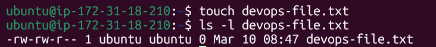
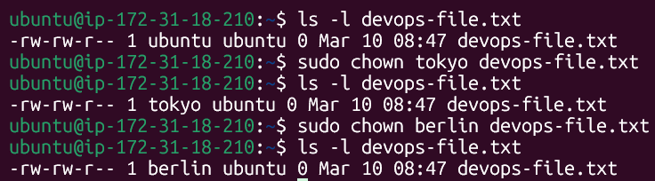
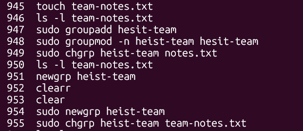
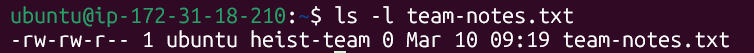
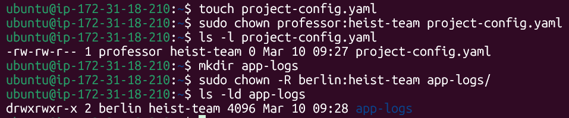
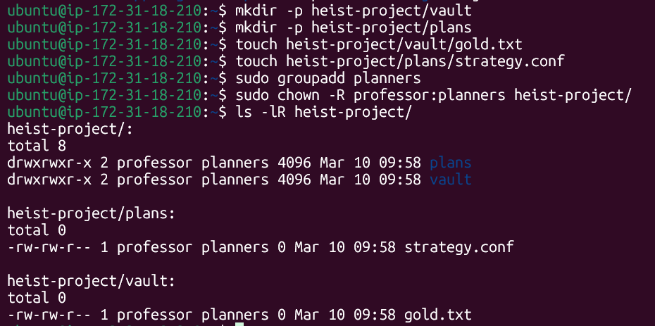
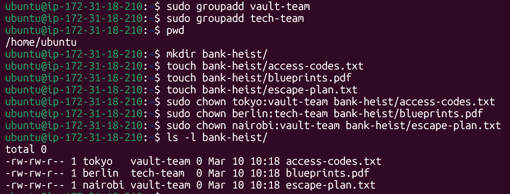

# File Ownership Challenge (chown & chgrp)
## Users Created
* tokyo
* berlin
* nairobi
* professor
## Groups Created
* heist-team
* planners
* vault-team
* tech-team
## Files & Directories Created
* devops-file.txt
* app-logs/
* bank-heist/access-codes.txt
* bank-heist/blueprints.pdf
* bank-heist/escape-plan.txt
* heist-project/plans/strategy.conf
* heist-project/vault/gold.txt
* project-config.yml
* team-notes.txt
## Understanding Ownership
* Run `ls -l` in your home directory
* Identify the owner and group columns
* Check who owns your files



* Owner: The owner is typically the user who has created the file or directory. The owner has the ability to modify its permissions
* Group: the group consists of multiple users who are granted the shared access to the file or directory
## Basic chown Operations
* Create file `devops-file.txt`
* Check the current owner of the file: `ls -l devops-file.txt`
* Change owner to `tokyo` (create the user if needed)
* Change owner to `berlin`
* Verify the changes



## Basic chgrp Operations
* Create file `team-notes.txt`
* Create group `sudo groupadd heist-team`
* Change the file group to `heist-team`
* Verify the change





## Combined Owner & Group Change
* Create file `project-config.yaml`
* Change owner to `professor` AND group to `heist-team` (one command)
* Create directory `app-logs/`
* Change its owner to `berlin` and group to `heist-team`
Syntax: `sudo chown owner:group filename`



## Recursive Ownership
1. Create directory structure:
```
mkdir -p heist-project/vault
mkdir -p heist-project/plans
touch heist-project/vault/gold.txt
touch heist-project/plans/strategy.conf
```
2. Create groups `planners`:`sudo groupdd planners`
3. Change ownership of entire `heist-project/` directory:
   * Owner: `professor`
   * Group: `planners`
   * Use recursive flag (`-R`)
4. Verify all files and subdirectories changed: `ls -lR heist-project/`



## Practice Challenge
1. Create users: `tokyo`,`berlin`,`nairobi` (if not created)
2. Create groups: `vault-team`,`tech-team`
3. Create directory: `bank-heist`
4. Create 3 files inside:
```
touch bank-heist/access-codes.txt
touch bank-heist/blueprints.pdf
touch bank-heist/escape-plan.txt
```
5. Set different ownership:
    * `access-codes.txt` -> owner:`tokyo`, group:`vault-team`
    * `blueprints.pdf` -> owner:`berlin`, group:`tech-team`
    * `escape-plan.txt` -> owner:`nairobi`, group:`vault-team`
Verify: `ls -l bank-heist/`



# Commands Used
* Verify Ownership: `ls -l filename`
* Change owner only: `sudo chown newowner filenme`
* Change group only: `sudo chown newgroup filename`
* Refresh new group: `sudo newgrp groupname`
* Change both owner and group: `sudo chown owner:group filename`
* Recursive change (directories): `sudo chown -R owner:group directory/`
* Change only group with chown: `sudo chown groupname filename`

# What I Learned
* Managing Users & Groups
* How File System ownership works
