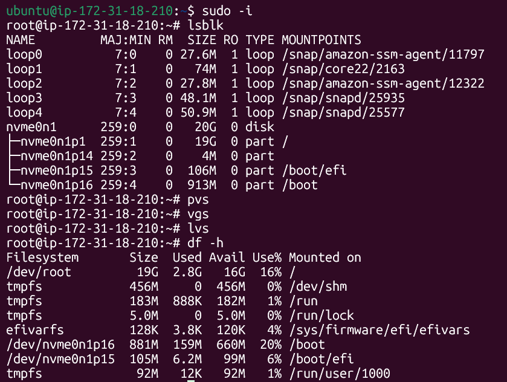
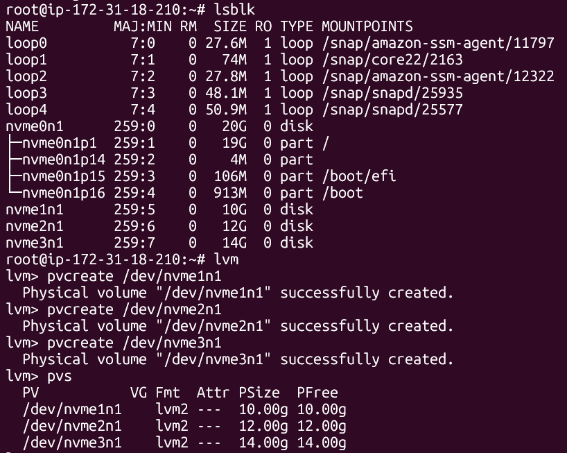
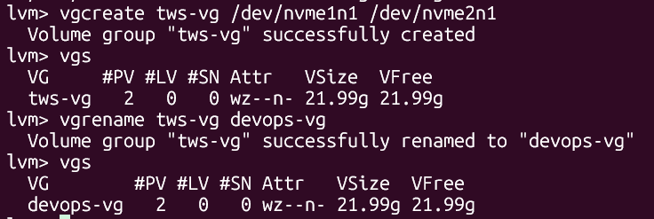
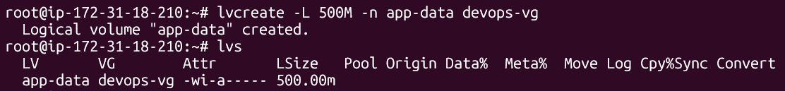
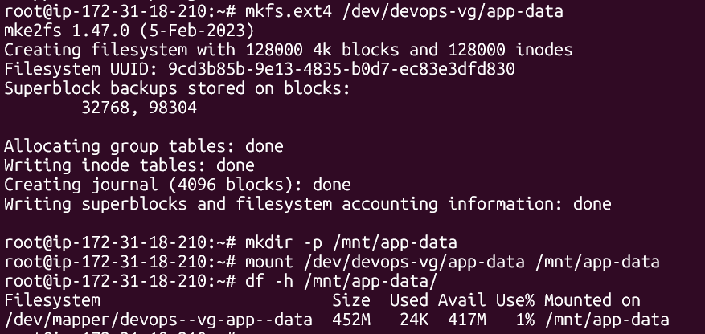
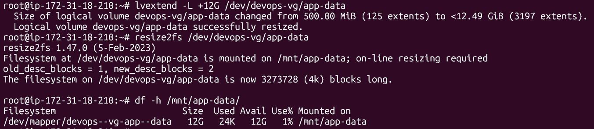
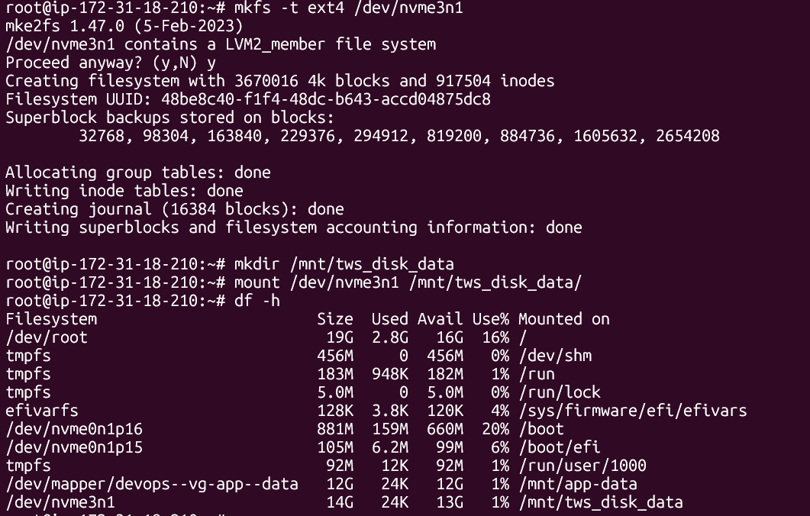

# Day 13 - Linux Volume Management (LVM)
## Task
Learn LVM to manage storage flexibly - create, extend, and mount volumes.
## Task 1: Check Current Storage
Run: `lsblk`,`pvs`,`vsg`,`lvs`,`df -h`



---
## Task 2: Create Physical Volume

```
pvcreate /dev/nvme1n1
pvs
```



---
## Task 3: Create Volume Group

```
vgcreate devops-vg /dev/nvme1n1 /dev/nvme2n1
vgs
```



---
## Task 4: Create Logical Volume

```
lvcreate -L 500M -n app-data devops-vg
lvs
```



---
## Task 5: Format and Mount

```
mkfs.ext4 /dev/devops-vg/app-data
mkdir -p /mnt/app-data
mount /dev/devops-vg/app-data /mnt/app-data
df -h /mnt/app-data
```



---
## Task 6: Extend the Volume

```
lvextend -L +200M /dev/devops-vg/app-data
resize2fs /dev/devops-vg/app-data
df -h /mnt/app-data
```



---
## Task 7: Mounting PV directly

```
mkfs -t ext4 /dev/nvme3n1
mkdir /mnt/tws_disk_data
mount /dev/nvme3n1 /mnt/tws_disk_data
df -h
```



---
## Commands Used
* `lsblk` - Displays block devices and their mount points
* `df -h` - Shows disk usage of mounted filesystems in a human-readable format
* `pvcreate /dev/sdf` - Initializes a disk or partition as Physical Volume (PV)
* `pvs` - Lists all available Physical Volumes
* `vgcreate vg_name /dev/sdf /dev/sdg` - Creates a Volume Group (VG) using the specified PV
* `vgs` - Displays all existing Volume Groups
* `lvcreate -L 5GB -n lv_name vg_name` - Creates a 5GB Logical Volume (LV) within the specified VG
* `lvextend -L +5G /dev/vg_name/lv_name` - Increases the size of the LV by 5GB
* `lvs` - Lists all Logical Volumes
* `mkfs.ext4 /dev/vg_name/lv_name` - Formats the LV with an ext4 filesystem
* `mount /dev/vg_name/lv_name /mnt/data` - Mounts the logical volume to the `/mnt/data` directory
* `resize2fs /dev/vg_name/lv_name` - Resizes the ext2/3/4 filesystem after extending the LV
* `mkfs -t ext4 /dev/sdf /mnt/data` - Formats a disk directly with ext4 and mounts it

---
## What I Learned
* LVM Storage Structure: Understood the hierarchy of LVM - Physical Volumes (PV) --> Volume Groups (VG) --> Logical Volumes (LV)
* LVM Flexibility: Unlike traditional disk partitioning, LVM allows storage volumes to be expanded or resized dynamically without system downtime
* Managing Physical Volumes: Learned how to convert raw disks or partitions into Physical Volumes using `pvcreate`
* Combining Storage with Volume Groups: Multiple Physical Volumes, can be grouped together into a Volume Group, enabling more efficient and flexible storage allocation
* Filesystem Expansion: After increasing the size of a Logical Volume, the filesystem must also be resized using `resize2fs` to utilize the additional space
* Formatting and Mounting: Practiced formatting Logical Volumes with a filesystem and mounting them to directories for system use
* Direct PV Mounting: While it is technically possible to format and mount a Physical Volume directly, it is generally discouraged because LVM provides better abstraction, scalability and management flexibility


