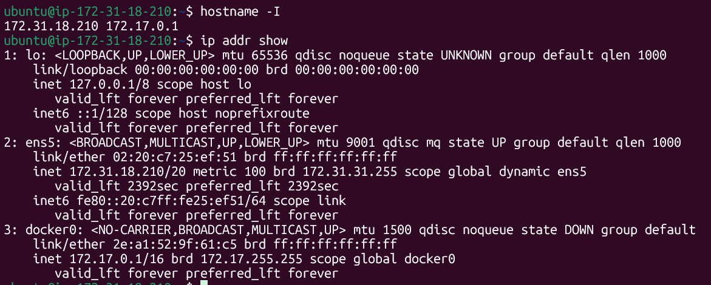
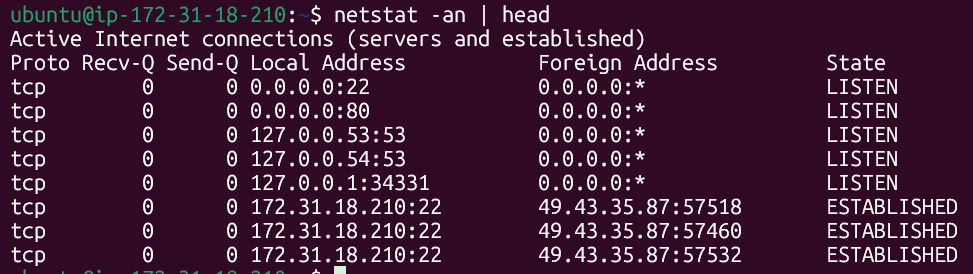

# Networking Fundamentals & Hands-on Checks

## Quick Concepts
1. OSI Layers (L1-L7) vs TCP/IP stack (Link, Internet, Transport, Application)

### OSI Layers (L1-L7)
The OSI model provides a detailed framework for data transmission, divided into seven distinct layers to define clear interfaces and independent functionality.

  * **L7 - Application** - Provides networking services directly to end-user applicantions (e.g., HTTP for browsers, SMTP for email)
  * **L6 - Presetation** - Handles data formatting, translation, encryption, and compression, ensuring the data is readable by the receiving application
  * **L5 - Session** - Manages sessions (connections) between applications, including establishment, maintenance, and termination
  * **L4 - Transport** - Manages end-to-end communication, including error control, flow control, and segmenation (TCP/UDP protocols)
  * **L3 - Network** - Handles logical addressing (IP addresses) and routing of data packets across different networks
  * **L2 - Data Link** - Manages physical addressing (MAC addresses) and provides error-free node-to-node frame transfer
  * **L1 - Physical** - Transmits raw binary data (0s and 1s) as electrical, optical, or radio signals over the physical medium

### TCP/IP Stack Layers (4-Practical Layers Stack)
The TCP/IP stack is a more condensed, practical model built on existing internet protocols, combining related functions

  * **Application (Maps to OSI L7,L6,L5)** - Handles high-level protocols (HTTP, FTP, DNS) and manages user interaction, data formatting, and session management
  * **Transport (Maps to OSI L4)** - Manages end-to-end reliability, flow control, and segmentation, utilizing TCP (reliable) or UDP (unreliable)
  * **Internet (Maps to OSI L3)** - Handles logical addressing and routing, primary using IP (Internet Protocol) to move packets across network boundaries
  * **Link / Network Access (Maps to OSI L2, L1)** - Manages the physical network hardware, MAC addresses, and data framing for transmission over physical media (e.g., Ethernet)

2. Where IP, TCP/UDP, HTTP/HTTPS, DNS sit in the stack

These networking protocols are organized into a "stack" or "model" to manage how data is transmitted from an application on one device to another across the internet. The most common framework is the 4-Layer TCP/IP model

  * **Application Layer (Top Layer)** - This is where user-facing apps and data reside
    * HTTP/HTTPS : Protocols used by web browsers and servers to converse, send, and receive web pages (HTML, images, etc). HTTP is secure, using encryption
    * DNS : The phonebook of the internet. It converts human-readable domain names (e.g., trainwithshubham.com) into machine-readable IP addresses
   
  * **Transport Layer (Middle)** - This layer defines how data is delivered, ensuring flow control and reliability
    * TCP (Transmission Control Protocol) : Reliable connection. Performs a 3-way handshake to ensure all data arrives in order, retransmitting lost packets. (Used by HTTP/HTTPS)
    * UDP (User Datagram Protocol) : Speed-focused connectionless protocol. No handshakes, no guarantees. Used for live streaming, gaming and VoIP
   
  * **Internet Layer (Lower Middle)** - This layer handles addressing and routing packets across networks
    * IP (Internet Protocol) - The "postal system" of the internet. It puts source and destination IP addresses on packets to ensure they are routed correctly across the globe

  * **Network Access Layer (Bottom)** - This layer maps to the physical networking hardware (Ethernet, Wi-Fi, cables)

3. One real example: `curl https://trainwithshubham.com`
  * When I run `https://trainwithshubham.com`, it sends a HTTP request at the application layer, establishes a TCP connection, routes packets via IP, and transmits data physically over the internet. Since it is HTTPS, TLS encryption is applied between application and transport layers

 ## Hands-on Checklist (run these; add 1-2 line observations)
 * Identity: `hostname -I` (or `ip addr show`)
   * The `hostname -I` command displys all the **IP addresses associated with the host system** across all network interfaces, except for loopback and IPv6 link-local addresses. The `ip addr show` command provides detailed information about all network interfaces on the system.

 * Reachability: `ping <target>`
   * This tool is used to test connectivity between your computer and another device on a network or the internet. It operates by sending small data packets and waiting for a response. It lets a user test and verify whether a specific destination IP address exists and can accept or respond to requests in computer network administration
 * Path: `traceroute <target>` or `<tracepath>`
   * The `tracepath trainwithshubham.com` command is used to trace the path (route) that packets take from your system to a destination and to detect network issues like delays or MTU (Maximum Transmission Unit) problems
 * Ports: `ss -tulpn` or `netstat -tulpn`
   * Command is used to check which ports are open and which services (processes) are listening on them

   
 * Name resolution: `dig <domain>` or `nslookup <domain>`
   * It returns basic DNS information. `dig` is used for debugging, while `nslookup` gives a simpler, basic DNS lookup
 * HTTP check: `curl -I <http/https-url>`
   * Sends a HEAD request to retrieve only HTTP headers, mainly used to check the status code and server response without downloading the full content
 * Connections snapshot: `netstat -an | head`
   * Lists all network connections in numeric format and displays only the first few lines to quickly inspect active or listening ports
  
  ## Mini Task: Port Probe & Interpret
  * Identify one listening port from `ss -tulpn`
    *  SSH service is running. Server is accepting SSH connection from any network interface on port 22
  * From the same machine, test it: `nc -zv localhost <port>`
    *  It checks if port 22 is open locally by attempting a TCP connection, confirming that the SSH service is running and reachable

    
  * Write one line: is it reachable? If not, what's the next check? (e.g., service status, firewall)
    * It is rechable. If not check with `systemctl status ssh`. It shows whether the service is running or inactive

   ## Reflection
   * Which command gives you the fastest signal when something is broken?
     * `curl -I <url>` gives the fastest signal because it quickly shows the HTTP status code (200, 500, 404 etc) without downloding the full response
   * What layer (OSI/TCP-IP) would you inspect next if DNS fails? If HTTP 500 shows up?
     * If DNS fails, check the Application layer (DNS) and then Network layer. Verify DNS resolution: `dig`, `nslookup`. Check `/etc/resolv.conf`
     * If HTTP 500 shows up: Check the Application layer. 500 = server error -> backend/app problem
   * Two follow-up checks you'd run in a real incident
     * Check service health: `systemctl status <service>`
     * `journalctl -u <service>` or `tail -f /var/log/nginx/error.log` 
