# Day 61 -- Introduction to Terraform and Your First AWS Infrastructure

## Challenge Tasks

### Task 1: Understand Infrastructure as Code (IaC)
Before touching the terminal, research and write short notes on:

1. What is Infrastructure as Code (IaC)? Why does it matter in DevOps?
* Infrastructure as Code (IaC) is the management and provisioning of infrastructure (servers, networks, databases) through machine-readable definition files rather than manual configuration like clicking around in a UI. 
* IaC treats infrastructure like application code - it can be written, tested, and stored in version control (like Git), making IT operations faster, safer, and more reliable.
* In short, IaC turns infrastructure management from a manual, chaotic process into a predictable, automated, and collaborative software task.
2. What problems does IaC solve compared to manually creating resources in the AWS console?
* Infrastructure as Code replaces the manual "clicking" in the AWS Console with a script or blueprint. This shift solves several critical problems that arise when your cloud setup grows beyond a simple project.
3. How is Terraform different from AWS CloudFormation, Ansible, and pulumi?
* `AWS CloudFormation`: AWS CloudFormation is built specifically for AWS, whereas Terraform is cloud-agnostic and works with Azure, Google Cloud, and others. CloudFormation is only limited inside of AWS.
* `Ansible`: Ansible is primarily a **configuration management** tool designed to install software and set up servers once they exist. Terraform is a **provisioning** tool designed to create the underlying infrastructure (like servers and networks) from scratch.
* `Pulumi`: Pulumi allows you to write infrastructure code using **standard programming languages** like Python, TypeScript, or Go. Terraform uses its own unique, simplified language called **HCL** (HashiCorp Configuration Language).
4. What does it mean that Terraform is "declarative" and "cloud-agnostic"?
* Terraform is a tool for managing IT infrastructure, acting as a declarative, cloud-agnostic system. **Declarative** means you define the "what" -- the final desired state (e.g., "5 servers") - and Terraform handles the "how" to create them. **Cloud-agnostic** means the same workflow and language work across different providers like AWS, Azure, and Google Cloud.

### Task 2: Install Terraform and Configure AWS
1. Install Terraform:
```
# macOS
brew tap hashicorp/tap
brew install hashicorp/tap/terraform

# Linux (amd64)
wget -O - https://apt.releases.hashicorp.com/gpg | sudo gpg --dearmor -o /usr/share/keyrings/hashicorp-archive-keyring.gpg
echo "deb [signed-by=/usr/share/keyrings/hashicorp-archive-keyring.gpg] https://apt.releases.hashicorp.com $(lsb_release -cs) main" | sudo tee /etc/apt/sources.list.d/hashicorp.list
sudo apt update && sudo apt install terraform

# Windows
choco install terraform
```
2. Verify
```
terraform -version
```
3. Install and configure the AWS CLI:
```
aws configure
# Enter your Access Key ID, Secret Access Key, default region (e.g., ap-south-1), output format (json)
```
4. Verify AWS access:
```
aws sts get-caller-identity
```
You should see your AWS account ID and ARN.
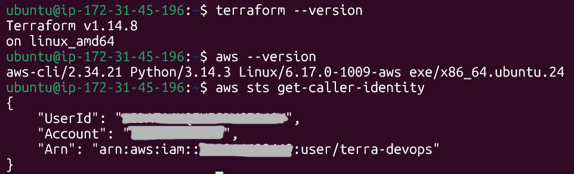

### Task 3: Your First Terraform Config -- Create a S3 Bucket

Create a project directory and write your first Terraform config:
```
mkdir terraform-basics && cd terraform-basics
```
Create a file called `main.tf` with:
1. A `terraform` block with `required_providers` specifying the `aws` provider
2. A `provider "aws"` block with your region
3. A `resource "aws_s3_bucket"` that creates a bucket with a globally unique name

Run the Terraform lifecycle:
```
terraform init      # Download the AWS provider
```
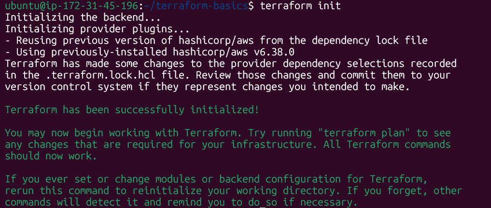
```
terraform plan      # Preview what will be created
```
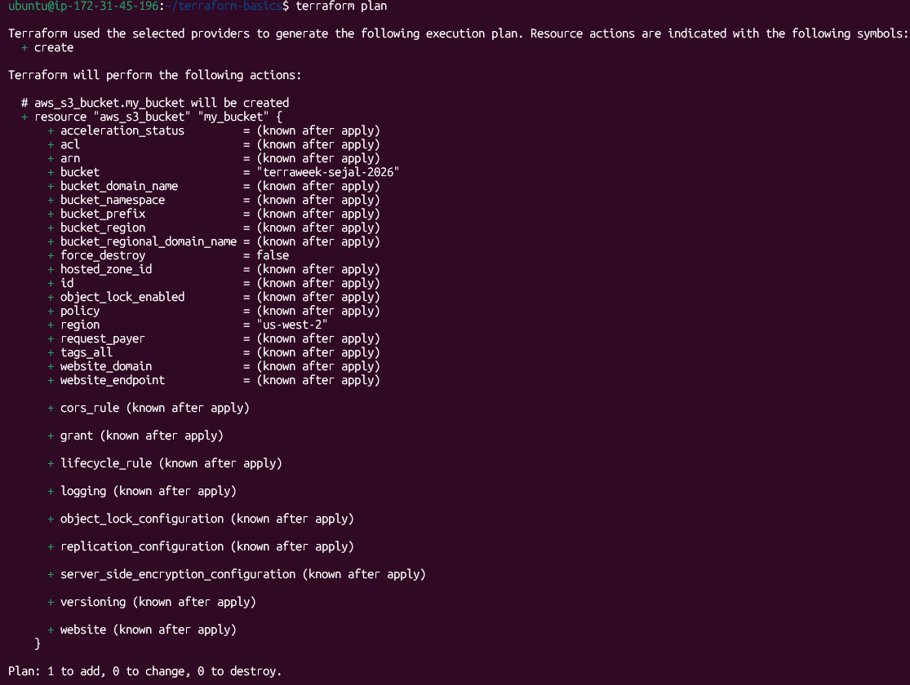
```
terraform apply     # Create the bucket (type 'yes' to confirm)
```
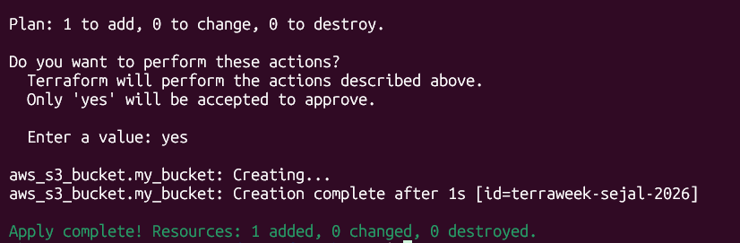

Go to the AWS S3 console and verify your bucket exists.
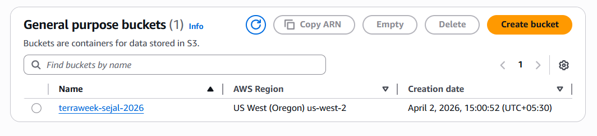

Document: What did `terraform init` download? What does the `.terraform/` directory contain?
* `terraform init` command initializes a working directory containing configuration files and installs plugins for required providers. 

* `.terraform/` directory is a hidden local cache created and managed by the `terraform init` command. It stores the external dependencies and configuration data required for Terraform to perform operation in a specific working directory

## Task 4: Add an EC2 Instance

In the same `main.tf` file, add:

1. A `resource "aws_instance"` using AMI `ami-0f5ee92e2d63afc18` (Amazon Linux 2 in ap-south-1 -- use the correct AMI for your region)
2. Set instance type to `t2.micro or t3.micro` whichever that comes under free tier
3. Add a tag: `Name = "TerraWeek-Day1"`

Run:
```
terraform plan      # You should see 1 resource to add (bucket already exists)
```
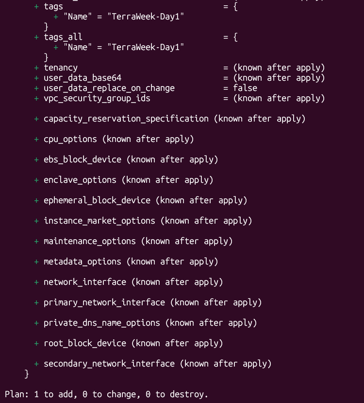
```
terraform apply
```
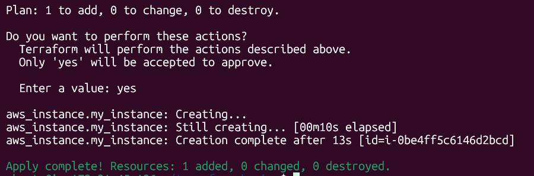

Go to the AWS EC2 console and verify your instance is running with the correct name tag.

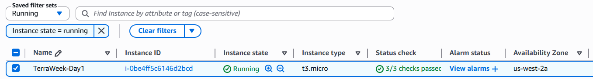

Document: How does Terraform know the S3 bucket already exists and only the EC2 instance needs to be created?
* Terraform keeps track of resources using its state file. Because the S3 bucket is already recorded in the state, Terraform doesn't try to create it again. However, since the EC2 instance isn't present in the state file, Terraform includes it in the plan for creation.

### Task 5: Understand the State File

Terraform tracks everything it creates in a state file. Time to inspect it.

1. Open `terraform.tfstate` file in your editor -- read the JSON structure
2. Run these commands and document what each returns:

```
terraform show                          # Human-readable view of current state
```
Shows all yours resources in detail in an easy-to-read-format. You can see things like EC2 details **(ID, IP, status)** and S3 bucket info
```
terraform state list                    # List all resources Terraform manages
```
Shows a simple list of all resources Terraform is managing.
*   Example: EC2 instance and S3 bucket names
```
terraform state show aws_s3_bucket.my_bucket   # Detailed view of a specific resource
```
Shows detailed information only for the S3 bucket, like its name, region, and settings.
```
terraform state show aws_instance.<name>
```
Shows detailed information only for the EC2 instance, like its ID, type, IPs, and tags.

3. Answer these questions in your notes:
    * What information does the state file store about each resource?

    The Terraform state file is aJSON-formatted "source of truth" that records a snapshot of your infrastructre. It stores the resource configuration and current attributes, such as resource ID, ARNs, IP addresses, tags and dependencies mapping Terraform config to a real infrastructure.

    * Why should you never manually edit the state file?

    The Terraform state file keeps track of your infrastructure. If you edit it manually, Terraform can get confused and make wrong changes (like deleting or recreating resources). So always use Terraform commands instead of editing it directly.

    * Why should the state file not be committed to Git?

    The Terraform state file may contain **sensitive data** (like keys, passwords, or resource details). If you commit it to Git, especially a public repo, it can **expose your infrastructure and credentials**. That's why it's safer to keep it secure and out of version control.

### Task 6: Modify, Plan, and Destroy

1. Change the EC2 instance tag from `"TerraWeek-Day1"` to `"TerraWeek-Modified"` in your `main.tf`

2. Run `terraform plan` and read the output carefully:
    * What do the `~`,`+`, and `-` symbols mean?
        * `~` Resource will be updated in-place
        * `+` Resource will be created
        * `-` Resource will be destroyed
    * Is this an in-place update or a destroy-and-recreate?
        * Changing the EC2 tag results in a `~ (in-place update)`
3. Apply the change
4. verify the tag changed in the AWS console

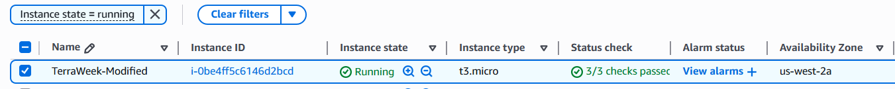

5. Finally, destroy everything:
```
terraform destroy -auto-apporve
```
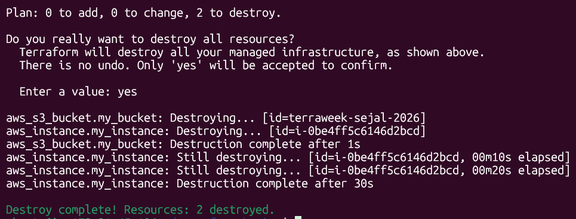

6. Verify in the AWS console -- both the S3 bucket and EC2 instance should be gone

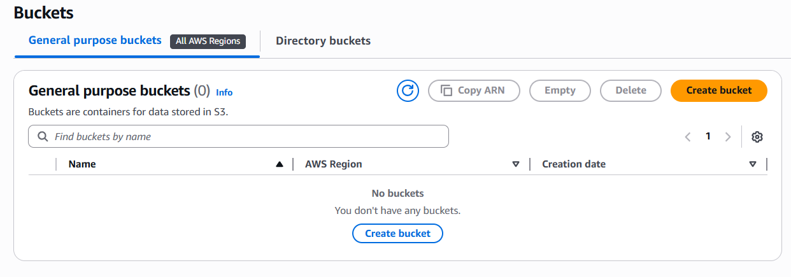

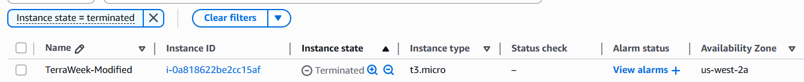

## Documentation

* IaC explanation in your own words (3-4 sentences)
    * **Infrastructure as Code** is a way to manage and create infrastructure using code instead of doing it manually.
    * It helps automate tasks, maintain consistency, and track changes using version control.

* Waht each Terraform command does?
    * `terraform init`: Sets up the project and downloads required providers/modules/plugins
    * `terraform plan`: Shows what changes will be made before applying
    * `terraform apply`: Creates or updates resources based on the plan
    * `terraform destroy`: Removes all managed resources
    * `terraform show`: Displays the current state in a readable format
    * `terraform state list`: Lists all resources tracked in the state file

* What does the state file contains and why it matters?
    * What it contains:
        * Resource IDs and ARNs
        * Current details (like IPs, tags, etc)
        * Mapping between Terraform code and actual resources
        * Resource dependencies

    * Why it matters:
        * Acts as Terrafrom's source of truth
        * Helps detect changes and plan updates
        * Avoids creating duplicate resources
        * Keeps infrastructure consistent and managed properly