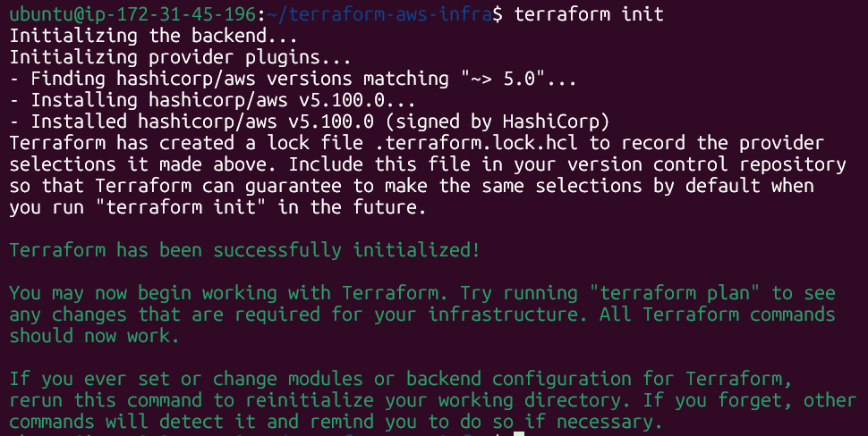
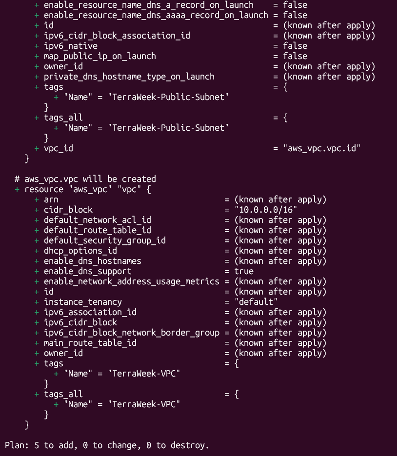
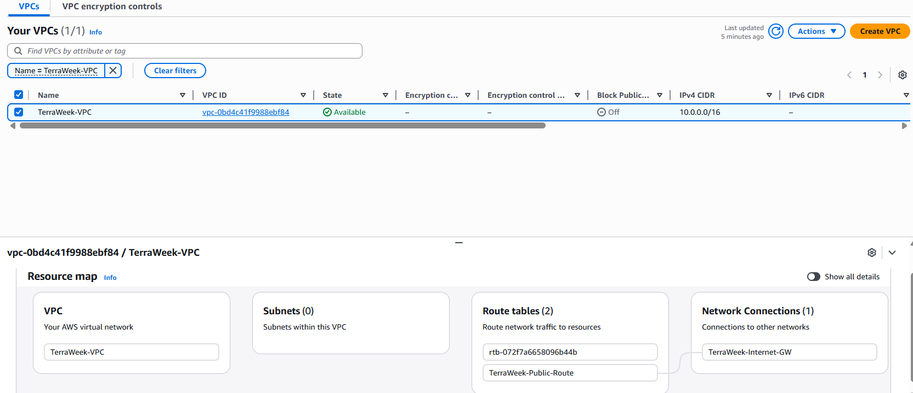
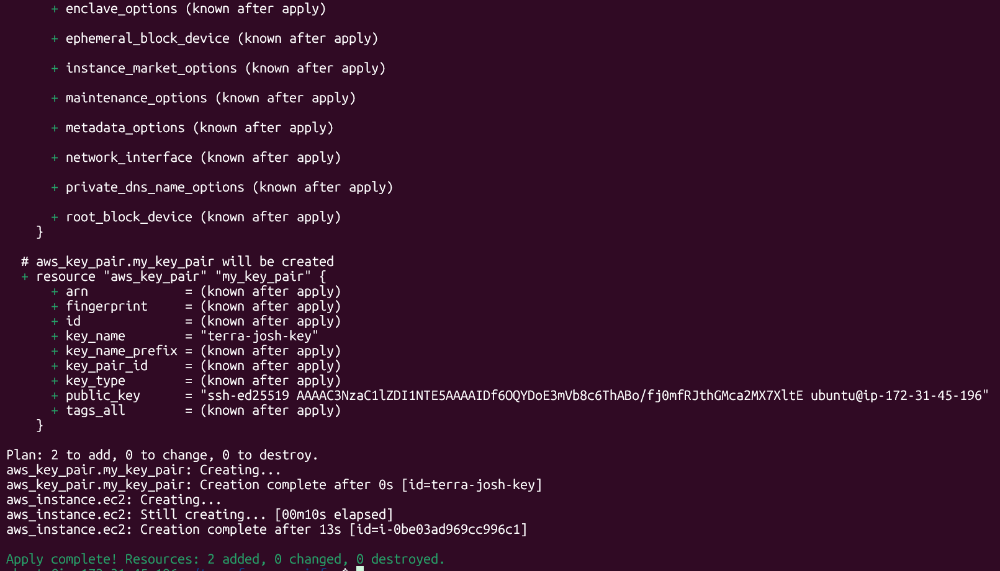
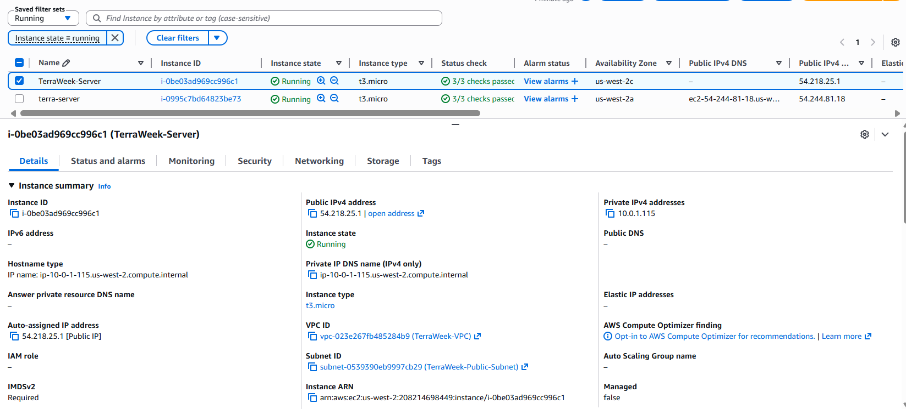
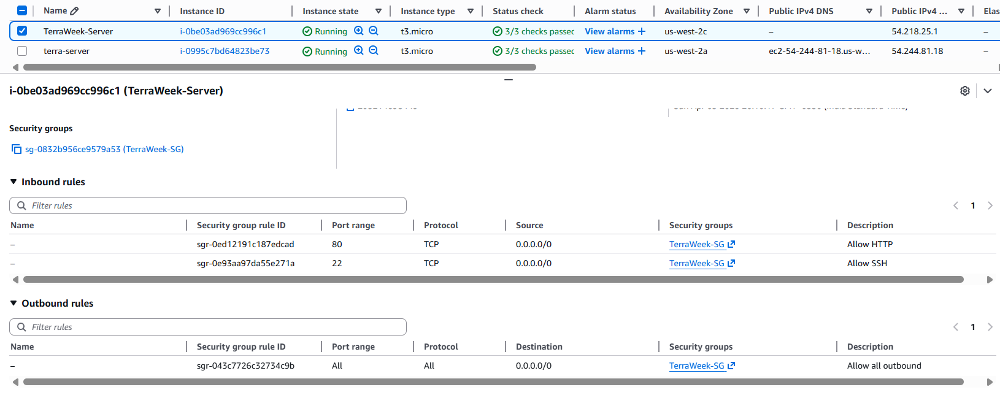
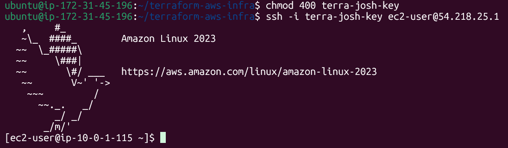
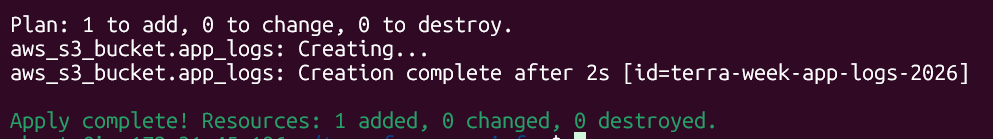
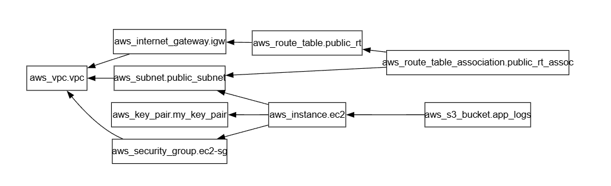

# Day 62 -- Providers, Resources and Dependencies

## Challenge Tasks

### Task 1: Explore the AWS Provider
1. Create a new project directory: `terraform-aws-infra`
2. Write a `providers.tf` file:
    * Define the `terraform` block with `required_providers` pining the AWS provider to version `~> 5.0`
    * Define the `provider "aws"` block with your region
3. Run `terraform init` and check the output -- what version was installed?
    * `v5.100.0` version was installed



4. Read the provider lock file `.terraform.lock.hcl` -- what does it do?
    * The `.terraform.lock.hcl` file is a dependency lock file that ensures your project uses the same exact provider versions and code every time it runs.

**Document:** What does `~> 5.0` mean? How is it different from `>=5.0` and `= 5.0.0`?

* `~> 5.0` - Pessimistic Constraint. Allows any version that is 5.0, but less than 6.0
* `>=5.0` - Allows any version above 5.0, anything newer even if it's 10.0
* `= 5.0.0` - Exact Pin. Forces terraform to use only version `5.0, requires manual updates for every change

---

### Task 2: Build a VPC from Scratch

Create a `main.tf` and define these resources one by one:

1. `aws_vpc` -- CIDR block `10.0.0.0/16`, tag it `"TerraWeek-VPC"`
2. `aws_subnet` -- CIDR block `10.0.1.0/24`, reference the VPC ID from step 1, enable public IP on launch, tag it `TerraWeek-Public-Subnet"`
3. `aws_internet_gateway` -- attach it to the VPC
4. `aws_route_table` -- Create it in the VPC, add a route for `0.0.0.0/0` pointing to the internet gateway
5. `aws_route_table_association` -- Associate the route table with the subnet

Run `terraform plan` -- you should see 5 resources to create

**Verify:** Apply and check the AWS VPC console. Can you see all five reources connected?
Yes, all the five resources are connected.





---

### Task 3: Understand Implicit Dependencies

Look at your `main.tf` carefully:
1. The subnet references `aws_vpc.main.id` -- this is an implicit dependency
2. The internet gateway references the VPC ID -- another implicit dependency
3. The route table association reference both the route table and the subnet

Answer these questions:

* How does Terraform know to create the VPC before the subnet?
    * Terraform determines the creation order by building a **Dependency Graph**. It does not simply read your code from top to bottom; instead, it analyzes the relationships between resources to understand which must exist first.
    * Terraform sees `vpc.id = aws_vpc.vpc.id` this reference and automatically schedules the VPC for creation before the subnet

* What would happen if you tried to create the subnet before the VPC existed?
    *Terraform will attempt to call the cloud provider's API. The API will return an error such as 
    * **For AWS:** - `InvalidVpcID.NotFound` The VPC ID `vpc_vpc.id` does not exist
    
* Find all implicit dependencies in your config and list them

| Resource Relationship                       | Terraform Reference Mapping                                                         |
|---------------------------------------------|-------------------------------------------------------------------------------------|
| Subnet -> VPC                               | `aws_subnet.public_subnet` -> `aws_vpc.vpc`                                         |
| Internet Gateway -> VPC                     | `aws_internet_gateway.internet_gw` -> `aws_vpc.vpc`                                 |
| Route Table -> VPC                          | `aws_route_table.public_route` -> `aws_vpc.vpc`                                     |
| Route Table Association -> Internet Gateway | `aws_route_table_association.public_rt_assoc` -> `aws_internet_gateway.internet_gw` |
| Route Table Association -> Subnet           | `aws_route_table_association.public_rt_assoc` -> `aws_subnet.public_subnet`         |
| Route Table Association -> Route Table      | `aws_route_table_association.public_rt_assoc` -> `aws_route_table.public_route`     |

---

### Task 4: Add a Security Group and EC2 Instance

Add to your config:

1. `aws_security_group` in the VPC:
    * **Ingress rule:** allow SSH (port 22) from `0.0.0.0/0`
    * **Ingress rule:** allow HTTP (port 80) from `0.0.0.0/0`
    * **Egress rule:** allow all outbound traffic
    * **Tag:** `TerraWeek-SG`

2. `aws_instance` in the subnet:
    * Use Amazon Linux 2 AMI for your region
    * Instance type: `t2.micro`
    * Associate the security group
    * Set `associate_public_ip_address = true`
    * Tag: `"TerraWeek-Server"`

Apply and verify -- your EC2 instance should have a Public IP and be reachable









---

### Task 5: Explicit Dependencies with depends_on

Sometimes Terraform cannot detect a dependency automatically.

1. Add a second `aws_s3_bucket` resource for application logs
2. Add `depends_on = [aws_instance.main]` to the S3 bucket -- even though there is no direct reference, you want the bucket created only after the instance
3. Run `terraform plan` and observe the order



Now visualize the entire dependency tree:

```
terraform graph | dot -Tpng > graph.png
```

If you don't have `dot` (Graphviz) installed, use:
```
terraform graph
```
and paste the output into an online Graphviz viewer.



**Document:** When would you use `depends_on` in real projects? Give two examples

1. Internet Gateway before EC2 (Network readiness)
    * Ensures internet access works immediately
    * Avoids debugging weird connectivity issues

2. S3 Bucket before Lambda Deployment
    * Prevents deployment failures
    * Ensures artifact is available before execution

---

### Task 6: Lifecycle Rules and Destroy

1. Add a `lifecycle` block to your EC2 instance:

```
lifecycle {
  create_before_destroy = true
}
```
2. Change the AMI ID to a different one and run `terraform plan` -- observe that Terraform plans to create the new instance before destroying the old one

3. Destroy everything:
```
terraform destroy
```
4. Watch the destroy order -- Terraform destroys in reverse dependency order. Verify in the AWS console that everything is cleaned up

**Document:** What are the three lifecycle arguements (`create_before_destroy`), `(prevent_destroy)`, `(ignore_changes)` and when would you use each?

* `create_before_destroy` - Create the new resource first, then deleted the old one. Used to avoid downtime during updates.

* `prevent_destroy` - Stops Terraform from deleting a resource accidentally. Usedfor critical resources like databases or S3 buckets.

* `ingore_changes` - Tells Terraform to ignore certain changes in a resource. Used when updates happen outside Terraform (like manual changes)

---

## Explanation of Implicit vs Explicit dependencies in your own words.

1. **Implicit Dependency:**
    * Terraform automatically understands the order of resources when one resource refereneces another. 
    * You don't need to define anything manually - it builds the dependency graph itself.
    * This is the most common and preferred way of handling dependencies.

2. **Explicit Dependency:**
    * Used when Terraform cannot automatically detect the dependency between resources.
    * You manually specify the order using `depends_on` to ensure correct execution.
    * It is mainly used in special cases like network setup or external dependencies.
